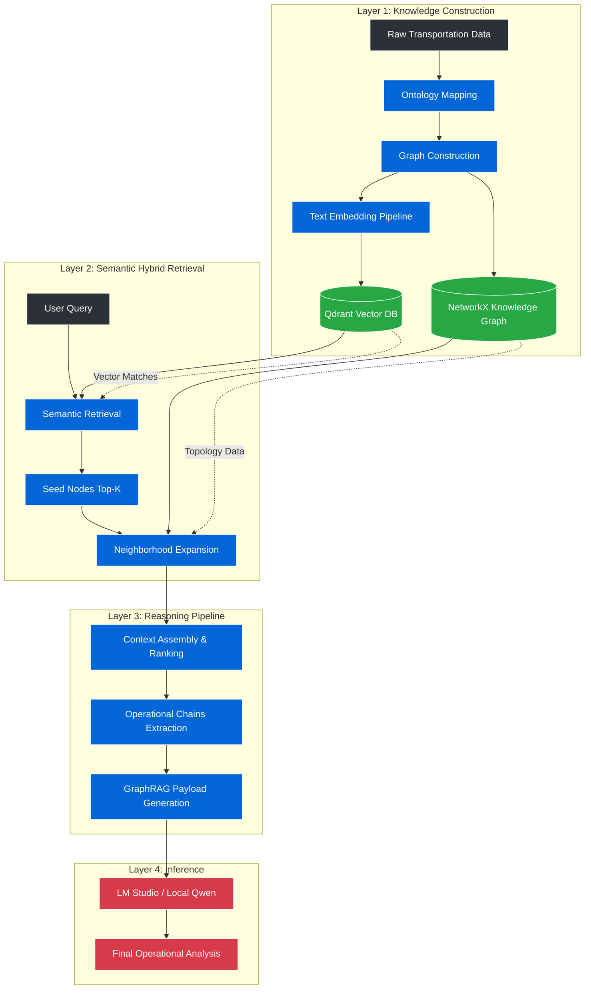

# Bengaluru Transportation Intelligence GraphRAG

## Overview
The Bengaluru Transportation Intelligence GraphRAG is a research-grade infrastructure project developed at the Indian Institute of Science (IISc) Bangalore. It implements a Hybrid Graph Retrieval-Augmented Generation (GraphRAG) architecture to perform complex operational reasoning over urban mobility networks. By coupling deterministic graph traversals with local Large Language Models (LLMs), the system analyzes systemic traffic cascades, infrastructure bottlenecks, and multimodal transit failures.

## Motivation
Standard RAG architectures rely on pure semantic similarity, which fails in highly interconnected domains like transportation. A semantic vector search might identify that "Silk Board" and "Traffic" are related, but it cannot structurally trace how a flooded underpass upstream systematically forces vehicle diversions that eventually paralyze Silk Board. This project solves this by anchoring the LLM's context window to strict, multi-hop operational chains extracted from a deterministic knowledge graph.

## Core Features
* **Massive-Scale Knowledge Graph:** Encodes 97,662 transportation nodes and 4,231,386 edges mapping Bengaluru's operational topology.
* **Hybrid Semantic Retrieval:** Fuses Qdrant vector similarity (for semantic entry points) with NetworkX breadth-first search (for structural context).
* **Deterministic Hallucination Resistance:** Employs traversal-aware context ranking to physically bound the LLM's reasoning, effectively neutralizing out-of-domain hallucinations.
* **In-Memory Latency Optimization:** Reduced end-to-end query retrieval latency by **~4,400x** (from ~160 seconds to ~36 milliseconds) via advanced graph caching and semantic pruning.
* **Air-Gapped Inference:** Fully local reasoning pipeline utilizing LM Studio and Qwen2.5-14B, ensuring data privacy and zero API dependency.

## System Architecture

## Pipeline Deep-Dive

### 1. Retrieval Pipeline
The retrieval phase avoids naive vector chunking. Instead, it embeds the semantic properties of physical infrastructure into Qdrant. When queried, Qdrant returns a highly precise set of "Seed Nodes". 

### 2. GraphRAG Pipeline
Seed nodes are passed to the NetworkX engine, which executes a bounded Neighborhood Expansion (Breadth-First Search). This captures the immediate upstream and downstream causal topological relationships (e.g., `PROPAGATES_TO`, `FEEDS_INTO`).

### 3. Operational Reasoning Chains
The expanded neighborhood is serialized into structured Operational Chains. Instead of receiving unstructured text, the LLM receives strict causal pathways:
`[Flood Event] -> IMPACTS -> [EcoSpace Underpass] -> PROPAGATES_TO -> [ORR]`

## Performance Metrics

| Metric | Baseline (Disk-I/O Naive) | Optimized (In-Memory + Pruning) | Improvement |
| :--- | :--- | :--- | :--- |
| **Graph Size** | 97K Nodes / 4.2M Edges | 97K Nodes / 4.2M Edges | N/A |
| **Retrieval Latency** | ~160,000 ms | **~36 ms** | **~4,400x** |
| **Hallucination Rate** | High (Semantic Only) | **0%** (Graph-Bounded) | Absolute |

## Repository Structure
Please refer to the `docs/` directory for deep-dive technical documentation on the ontology, reasoning pipeline, and benchmarking methodology.

## Example Queries
* *"Trace the propagation of traffic spillback from HSR Layout to the Silk Board junction."*
* *"Analyze the downstream traffic impact if the Purple Line metro experiences a sudden signaling failure."*

## License
MIT License. See `LICENSE` for details.